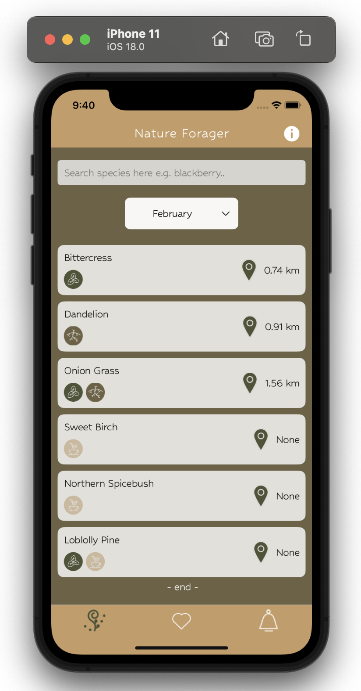
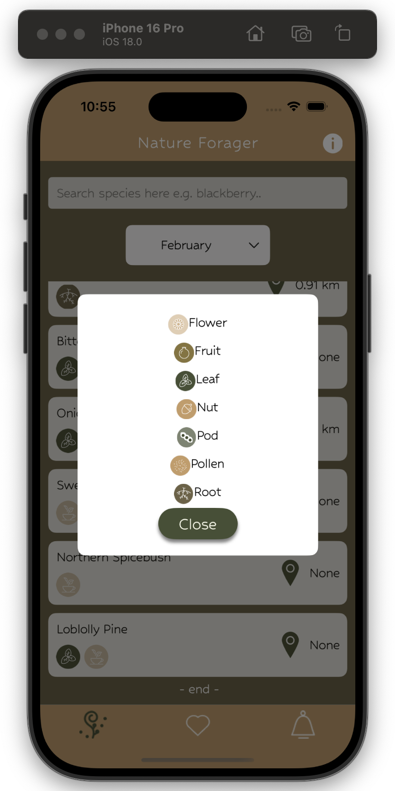
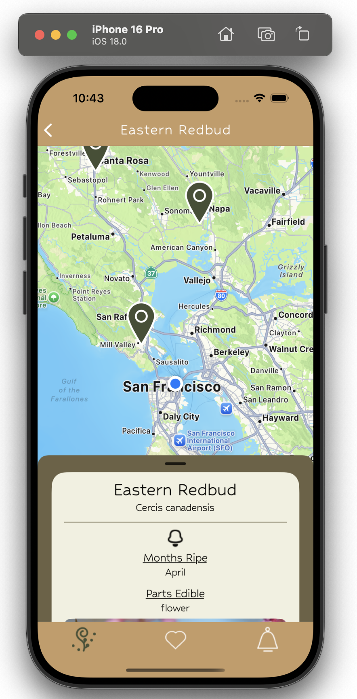
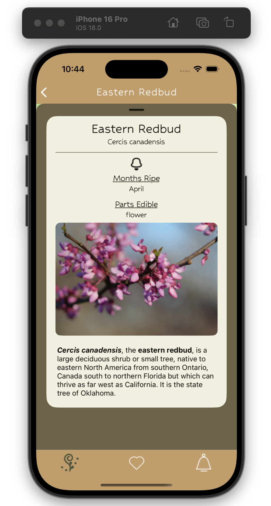
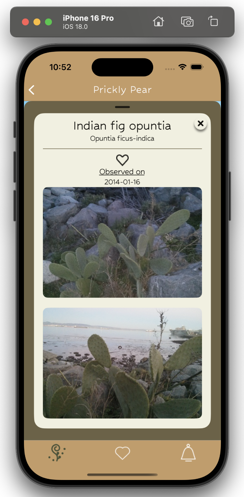
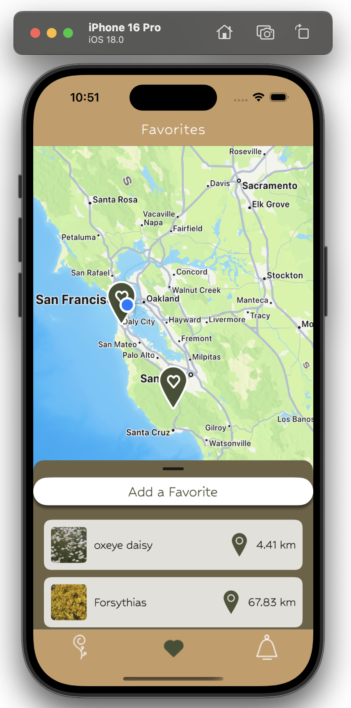
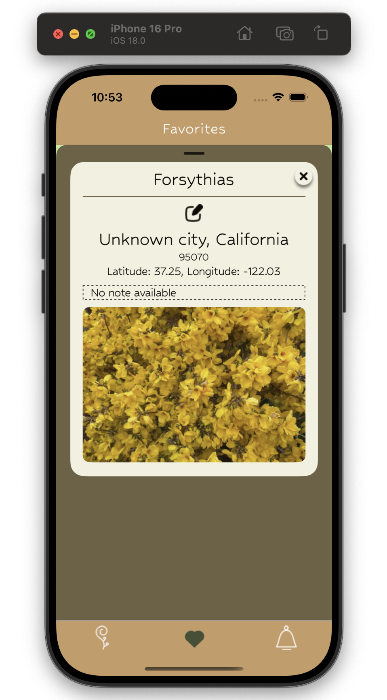
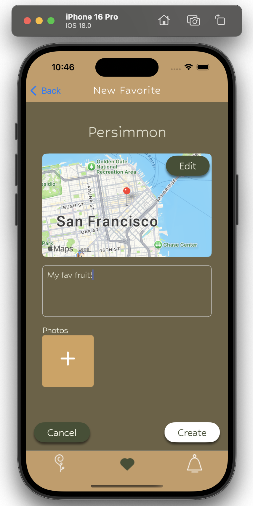
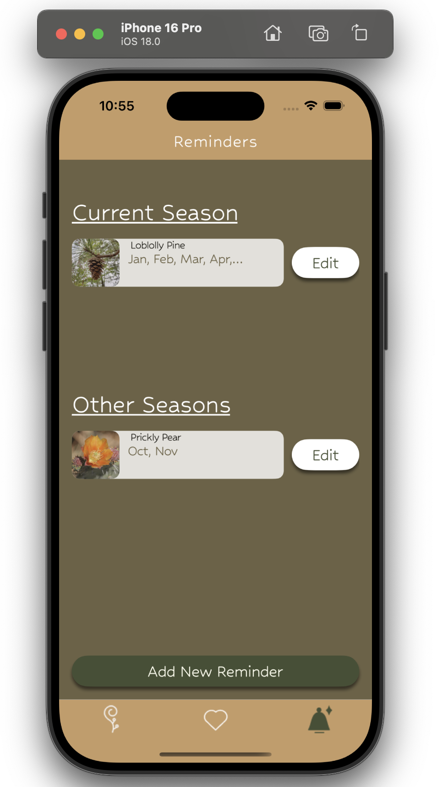

# Plant-Forager

## Figma Prototype

Link: https://www.figma.com/design/ldIUpXGM6ZjS1f6w5jtszy/Nature-App?node-id=25-221&t=abNgjSVOP5fzMYyD-1


## Functionalities
Nature Forager has 3 main functions where users can search for plants, favourite plants, and set up reminders for upcoming plants.

1. **Search Plant** <br>
Users can search for plants in different months, view species details, and observation details through map interaction.<br>
  <br>
  <br>

3. **Favourite Plant** <br>
Users can favourite plants of interest through the search function above, or add self-configured plants. They are also free to change details afterwards.<br>
  <br>

5. **Plant Reminder** <br>
Users can set up reminders for plants so that they will get reminded through push notifications on the phone. The frequency of the reminder can be set to monthly, biweekly or weekly. The reminder tab was divided into "Current Season" and "Other Season" so that users can quickly locate current-season reminded plants.<br>
<br>


## Instructions for running

1. **Clone the repo**

   ```bash
   git clone https://gitlab.oit.duke.edu/amk119/plant-forager.git
   ```

2. **Install Project Dependencies**

   - Open the terminal and navigate to the project directory.

   ```bash
   cd plant-forager
   ```

   - Install the required dependencies using npm.

   ```bash
   npm install
   ```

3. **Running on iOS Simulator**

   - Download the iPhone Simulator

     - Open Xcode and navigate to `Preferences > Platforms`.
     - Download the **iPhone 15 Pro - iOS 17.0 Simulator**.

   - In the terminal, run:

   ```bash
    npm start
   ```

   - After the Metro Bundler starts, press 'i'

4. **Running on Android Emulator**

- Download the Android Emulator

  - Set up an Android Virtual Device in Android Studio:
    - Device: **Pixel 8 Pro**
    - System Image: Select the API level **VanillaIcecream**.

- Make sure the Android Emulator is open and running, then in the terminal, run:


    ```bash
     npm start
    ```

- After the Metro Bundler starts, press 'a'

## Team Workflow

- `git fetch origin` to update your local repository to include the latest changes from the remote main branch.
- `git merge origin/main` to merge with the latest changes before new push
- create a new merge request and assign yourself to assignee
- Assign anyone else to reviewer to review the code before allowing the merge request
